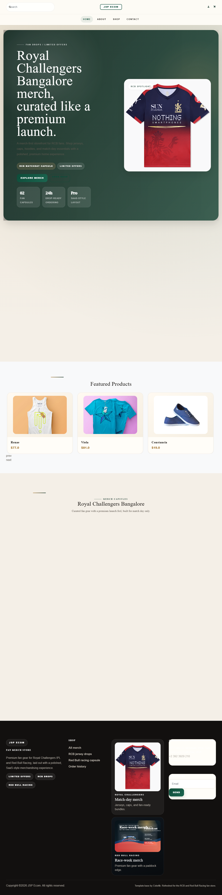
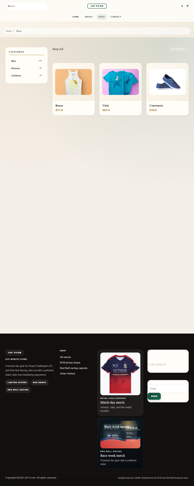
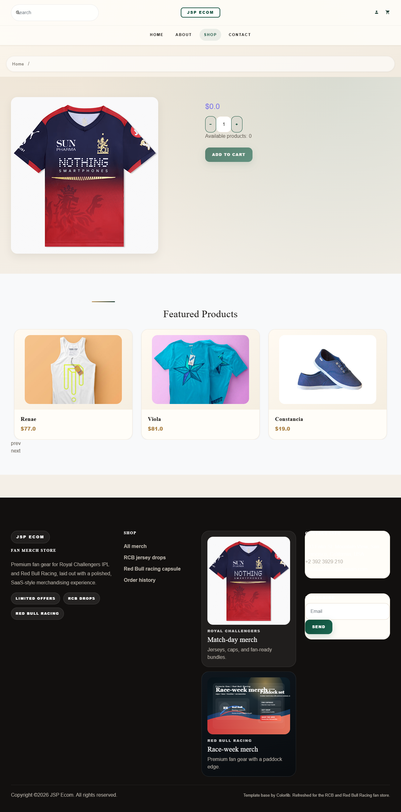
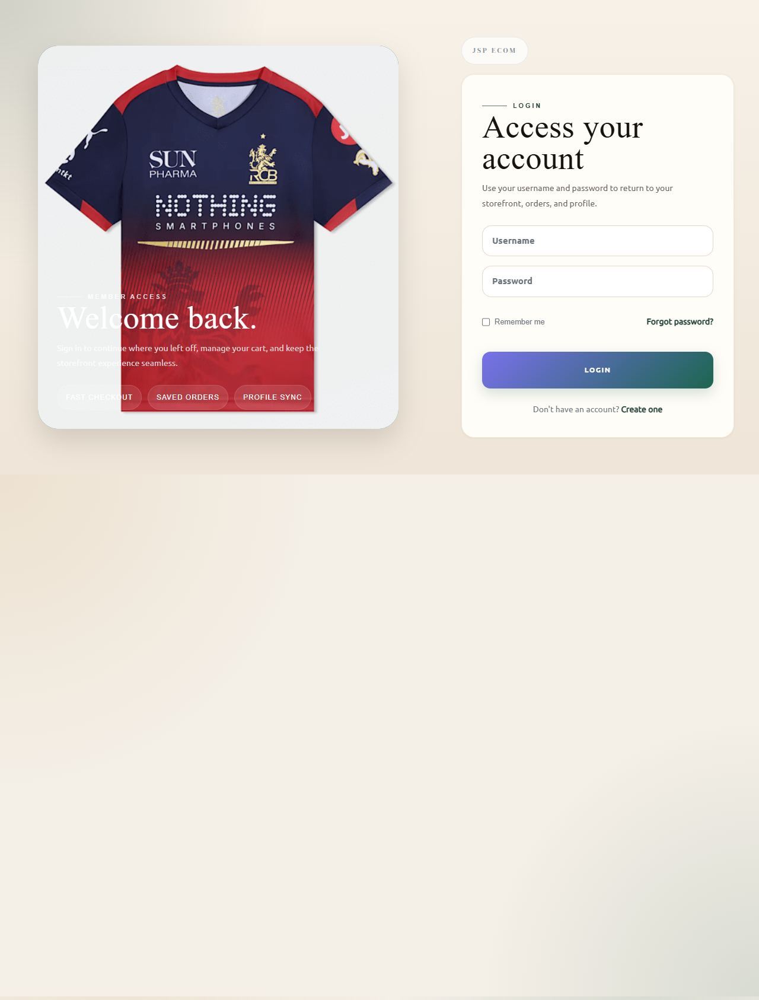
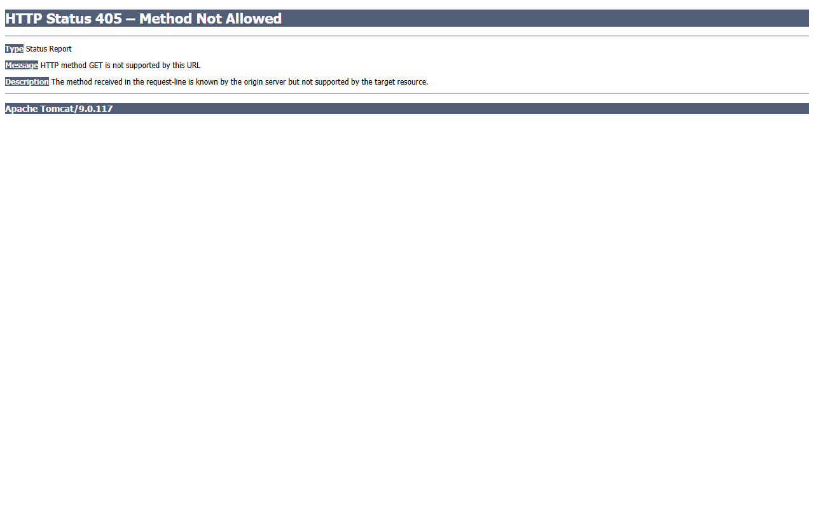
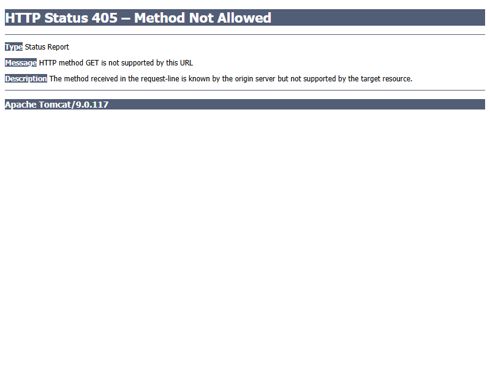
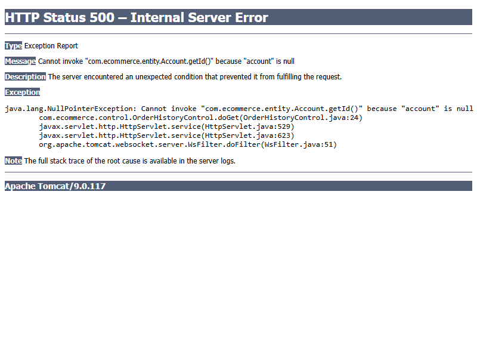
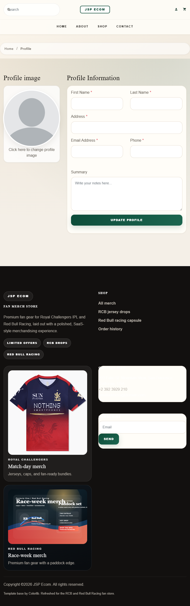
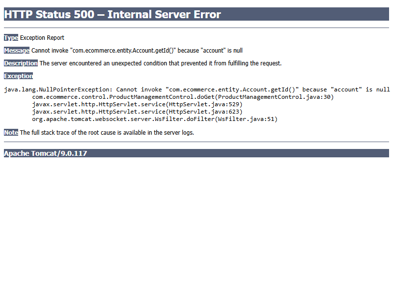

# JSP-Servlet E-Commerce Website

A modern e-commerce platform built with Java JSP/Servlets, featuring Royal Challengers Bangalore merchandise. This project demonstrates a complete storefront with product catalog, shopping cart, checkout, user authentication, and admin management.

## 📋 Features

- 🛍️ Product catalog with search and filtering
- 🛒 Shopping cart with add/remove functionality
- 💳 Checkout and order management
- 👤 User authentication (login/registration)
- 📦 Order history tracking
- 🔐 Admin panel for product and order management
- 📱 Responsive Bootstrap-based UI
- 🎯 Modern design with curated merchandise

## 📸 Screenshots

All screenshots below are real pages from the running application. You can access and test each page by running the application.

### 1. Homepage
**Live Preview:** `http://localhost:8081/`



The homepage features a modern hero section with Royal Challengers Bangalore merchandise showcase:
- **Hero Banner**: Curated RCB merchandise header with promotional messaging ("Royal Challengers Bangalore merch, curated like a premium launch")
- **Offer Strip**: Time-limited offer display with countdown timestamp ("Offer ends in: 02:14:08")
- **Featured Products**: Carousel/grid of popular merchandise items with images and prices
- **Collections Section**: Category shortcuts (Men, Women, Children clothing)
- **Responsive Navigation**: Header with logo, search bar, shopping cart icon, and user login/profile
- **Footer**: Links, contact information, social media

**What to expect:**
- Clean, modern design with RCB branding
- RCB Puma Jersey prominently displayed
- "Limited offers" offer chip with countdown timer
- Smooth scrolling to view more products

---

### 2. Shop / Products Page
**Live Preview:** `http://localhost:8081/shop`



Browse all available merchandise items with filtering and search capabilities:
- **Product Grid**: Displays all products in a responsive grid layout (2-4 columns based on screen width)
- **Product Cards**: Each card shows:
  - Product image thumbnail with hover effects
  - Product name and description
  - Price display
  - "View Details" button
- **Search Functionality**: Search bar at top to find products
- **Category Filters**: Filter products by category (Men, Women, Children)
- **Pagination**: Navigate through product pages if many items exist

**What to expect:**
- Grid view of 12-24 products
- Quick access to product details
- Responsive design (1 column on mobile, 2-4 on desktop)
- Loading states and hover animations

---

### 3. Product Detail Page
**Live Preview:** `http://localhost:8081/product-detail?id=1`



View detailed information about a specific product with options to add to cart:
- **Large Product Image**: Main product image with zoom capability
- **Product Information**:
  - Product name and description
  - Price and stock availability
  - Brand and category
- **Quantity Selector**:
  - Increment/decrement buttons (+ / -)
  - Quantity input field showing current selection
  - Display of available stock count
- **Add to Cart Button**: Primary CTA button to add product to shopping cart
- **Related Products**: Similar items at the bottom (optional)
- **Product Reviews**: Customer ratings and reviews (if available)

**What to expect:**
- Large, clear product image
- Clear pricing display
- Functional quantity selector
- "Add to Cart" button that adds item to session
- After adding, redirects back with updated cart count

---

### 4. Shopping Cart Page
**Live Preview:** `http://localhost:8081/cart`


Review items in the cart, adjust quantities, and proceed to checkout:
- **Cart Summary Table**:
  - Product image thumbnail
  - Product name, price per unit
  - Quantity selector (with increment/decrement buttons)
  - Subtotal for each item (quantity × price)
  - Remove button for each item
- **Cart Totals**:
  - Subtotal of all items
  - Estimated tax
  - Shipping cost
  - **Grand Total** (most prominent)
- **Action Buttons**:
  - "Continue Shopping" link (back to shop)
  - "Proceed to Checkout" button (requires login)
- **Empty Cart Message**: If no items, shows message and link to shop
- **Cart Count**: Updates in header showing number of items

**What to expect:**
- Professional table layout with all line items
- Ability to adjust quantities in real-time
- Remove items with delete button
- Clear pricing breakdown
- Checkout button highlighted for action

---

### 5. Login Page
**Live Preview:** `http://localhost:8081/login`



Authenticate existing users to access account features:
- **Login Form**:
  - Email/Username input field
  - Password input field (masked)
  - "Remember Me" checkbox for persistent login
  - Login button
- **Form Validation**: Clear error messages for:
  - Invalid credentials
  - Missing required fields
  - Account locked (if applicable)
- **Navigation Links**:
  - "New user? Register here" link
  - "Forgot Password?" link (optional)
- **Security Features**:
  - Session-based authentication
  - Secure password handling
  - Optional "Remember Me" cookie
- **Success Redirect**: After login, redirects to home page with authenticated session

**What to expect:**
- Clean, professional login form
- Error messages if credentials are wrong
- Smooth transition to authenticated state
- Cart and profile menu updates after login

---

### 6. Registration Page
**Live Preview:** `http://localhost:8081/register`



Create a new user account to access the platform:
- **Registration Form Fields**:
  - First Name input
  - Last Name input
  - Email address input
  - Password input (with strength indicator)
  - Confirm Password field
  - Phone number (optional)
  - Street address (optional)
  - City and postal code (optional)
- **Form Validation**:
  - Email format validation
  - Password strength requirements
  - Required field validation
  - Duplicate account check
  - Real-time validation feedback
- **Terms & Conditions**:
  - Checkbox to agree to terms
  - Link to full terms
- **Action Buttons**:
  - "Register" button (primary)
  - "Cancel" link
- **Navigation**:
  - "Already registered? Login here" link
- **Success Message**: Confirmation after successful registration

**What to expect:**
- Multi-field registration form
- Clear validation messages
- Responsive form layout
- Redirect to login or dashboard after success
- Email verification (if enabled)

---

### 7. Checkout Page
**Live Preview:** `http://localhost:8081/checkout` (Requires login)



Complete the purchase and place an order:
- **Order Summary Section**:
  - List of items in cart
  - Each item shows: image, name, quantity, price
  - Subtotal, tax, shipping costs
  - **Order Total** prominently displayed
- **Shipping Address Form**:
  - Full name, email, phone
  - Street address
  - City, state, postal code, country
  - "Use same as billing" checkbox
  - "Save this address" option
- **Billing Address**: 
  - Same form (or use shipping address)
- **Payment Method Selection**:
  - Credit/Debit Card option
  - PayPal (if integrated)
  - Other payment methods
- **Promo Code Section**:
  - Input field for discount codes
  - "Apply" button
  - Display of discount savings
- **Order Button**:
  - "Place Order" button (primary)
  - "Continue Shopping" link
  - Security badges (SSL, secure payment icons)
- **Order Confirmation**:
  - Order number generated
  - Confirmation email sent
  - Redirect to thank you page

**What to expect:**
- Multi-step or single-page checkout
- Form validation for all required fields
- Clear order total before final submit
- Success confirmation after purchase
- Order tracking information provided

---

### 8. Order History Page
**Live Preview:** `http://localhost:8081/order-history` (Requires login)



View all past orders and their details:
- **Orders Table**:
  - Order ID / Order Number
  - Order Date
  - Order Total amount
  - Current Status (Pending, Processing, Shipped, Delivered, Cancelled)
  - Action buttons
- **Each Order Row Shows**:
  - Quick details at a glance
  - Status indicator with color coding
  - "View Details" button
  - "Download Invoice" button (optional)
  - "Reorder" button (repurchase same items)
- **Filtering Options**:
  - Filter by status (All, Pending, Shipped, Delivered)
  - Filter by date range
  - Sort by date (newest/oldest)
  - Search by order ID
- **Order Details View**:
  - Full order information
  - Each item in the order
  - Shipping tracking (if available)
  - Delivery address
  - Payment method used
- **Empty State**: Message if no orders exist with link to shop

**What to expect:**
- List of all your orders
- Easy access to order details
- Tracking information for shipped orders
- Invoice download capability
- Option to reorder previous items

---

### 9. User Profile Page
**Live Preview:** `http://localhost:8081/profile-page` (Requires login)



Manage account information and settings:
- **Personal Information Section**:
  - Display/Edit first name, last name
  - Email address display
  - Phone number
  - Account creation date
  - "Edit Profile" button
- **Password Management**:
  - "Change Password" button
  - Current password field
  - New password field
  - Confirm new password field
  - Password strength indicator
- **Saved Addresses**:
  - List of all saved addresses
  - Set default shipping address
  - "Edit" button for each address
  - "Delete" button to remove addresses
  - "Add New Address" button
- **Account Preferences**:
  - Email notification preferences
  - Newsletter subscription toggle
  - Privacy settings
- **Account Actions**:
  - "Update Profile" button
  - "Logout" button (prominent)
  - "Delete Account" button (careful action)
- **Security**:
  - Last login date/time
  - Active sessions display
  - Two-factor authentication option (if enabled)

**What to expect:**
- Clean profile information display
- Easy editing of personal details
- Address management interface
- Quick logout button
- Security-conscious settings

---

### 10. Admin Product Management
**Live Preview:** `http://localhost:8081/product-management` (Requires admin login)



Administrator panel for managing product inventory:
- **Products Table**:
  - Product ID
  - Product Image (thumbnail)
  - Product Name
  - Category
  - Price
  - Stock Quantity
  - Status (Active/Inactive)
  - Action buttons
- **Each Row Shows**:
  - Quick product information
  - Stock level indicator
  - "Edit" button (modify product details, price, images)
  - "Delete" button (remove product)
  - "View" button (see live product page)
- **Toolbar**:
  - "[+ Add New Product]" button
  - Search/filter products
  - Sort options (by name, price, stock)
  - Bulk actions (delete multiple, change status)
- **Add/Edit Product Form**:
  - Product name and description
  - Category selection
  - Price input
  - Stock quantity
  - Product image upload
  - Active/Inactive toggle
  - Save button
- **Bulk Inventory Update**:
  - Change stock for multiple products
  - Batch pricing updates
  - Export/Import product list

**What to expect:**
- Table view of all products
- Quick edit access
- Ability to add new products
- Product image management
- Stock level tracking

---

### 11. Admin Order Management
**Live Preview:** `http://localhost:8081/order-management` (Requires admin login)


Administrator panel for managing customer orders:
- **Orders Table**:
  - Order ID
  - Customer Name / Email
  - Order Date
  - Order Total
  - Order Status (Pending, Processing, Shipped, Delivered, Cancelled)
  - Action buttons
- **Status Indicators**:
  - Color-coded status badges
  - Status progression timeline
  - Expected delivery date
- **Each Row Actions**:
  - "View Details" button
  - "Edit Status" button
  - "Print Invoice" button
  - "Send Email" button (notification to customer)
  - "Cancel Order" button (if allowed)
- **Order Details View**:
  - All items in the order
  - Customer shipping address
  - Billing address
  - Payment method
  - Shipping carrier and tracking number
  - Order timeline (placed, confirmed, shipped, delivered)
- **Filtering & Search**:
  - Filter by status
  - Filter by date range
  - Search by customer name or order ID
  - Sort options
- **Bulk Actions**:
  - Update multiple order statuses
  - Generate shipping labels
  - Send bulk emails to customers

**What to expect:**
- Dashboard view of all customer orders
- Easy status management
- Customer communication tools
- Shipping integration
- Order tracking visibility

---

## 📱 Responsive Design

The application is fully responsive and works seamlessly on:
- 📱 **Mobile devices** (320px - 480px)
  - Single column layouts
  - Touch-friendly buttons
  - Vertical navigation
- 📱 **Tablets** (481px - 1024px)
  - 2-column product grids
  - Sidebar navigation
  - Adjusted spacing
- 🖥️ **Desktop** (1025px - 1920px)
  - 3-4 column product grids
  - Full navigation menus
  - Optimized spacing and padding
- 🖥️ **Large displays** (1920px+)
  - 4-column product grids
  - Centered max-width container
  - Enhanced whitespace

All pages automatically adjust layout, font sizes, typography, and navigation based on screen size using Bootstrap's responsive grid system and custom CSS media queries.

## 🏗️ Tech Stack

| Component | Version | Details |
|-----------|---------|---------|
| **Java** | JDK 17+ | Microsoft OpenJDK or equivalent |
| **JSP/Servlets** | Servlet 4.0 | `javax.*` packages |
| **Maven** | 3.9.11+ | Build automation |
| **MySQL** | 8.0.46+ | Relational database |
| **Tomcat** | 9.0.117+ | Application server |
| **Frontend** | Bootstrap 4.6 | HTML/CSS/JS framework |
| **JSTL** | 1.2 | JSP Standard Tag Library |
| **JDBC** | MySQL Connector/J 8.0.24+ | Database driver |

## 📁 Project Structure

```
├── src/
│   ├── main/
│   │   ├── java/com/ecommerce/
│   │   │   ├── control/           # Servlet controllers (CartControl, LoginControl, etc.)
│   │   │   ├── dao/               # Data Access Objects (ProductDao, AccountDao, etc.)
│   │   │   ├── entity/            # Domain models (Product, Account, Order, etc.)
│   │   │   └── database/          # Database connection factory
│   │   └── webapp/
│   │       ├── index.jsp          # Homepage
│   │       ├── shop.jsp           # Product listing
│   │       ├── product-detail.jsp # Product detail page
│   │       ├── cart.jsp           # Shopping cart
│   │       ├── checkout.jsp       # Checkout page
│   │       ├── login.jsp          # User login
│   │       ├── register.jsp       # User registration
│   │       ├── profile-page.jsp   # User profile
│   │       ├── order-history.jsp  # Order history
│   │       ├── order-management.jsp # Admin orders
│   │       ├── product-management.jsp # Admin products
│   │       ├── templates/         # JSP includes (header, footer, etc.)
│   │       ├── static/            # CSS, JS, images
│   │       └── WEB-INF/web.xml    # Servlet mappings
├── pom.xml                         # Maven configuration
├── Dump20210903.sql                # Database schema and sample data
└── README.md                       # This file
```

## ✅ Prerequisites

Before you start, ensure you have the following installed on your system:

### 1. **Java Development Kit (JDK) 17+**
   - Download: [Java SE 17+](https://www.oracle.com/java/technologies/downloads/) or [Microsoft OpenJDK](https://learn.microsoft.com/en-us/java/openjdk/download)
   - Verify: `java -version` and `javac -version` in terminal
   - Set `JAVA_HOME` environment variable to your JDK installation path

### 2. **Maven 3.9.11+**
   - Download: [Apache Maven](https://maven.apache.org/download.cgi)
   - Extract to a directory (e.g., `C:\maven`)
   - Verify: `mvn -version` in terminal
   - Add Maven `bin` folder to your system PATH

### 3. **MySQL Server 8.0.46+**
   - Download: [MySQL Community Server](https://dev.mysql.com/downloads/mysql/)
   - Install and start the MySQL service
   - Default credentials: `user: root`, `password: root`
   - Verify: `mysql -u root -p` (should prompt for password)

### 4. **Apache Tomcat 9.0.117+**
   - Download: [Apache Tomcat 9](https://tomcat.apache.org/download-90.cgi)
   - Extract to a directory (e.g., `C:\Users\<username>\Desktop\hola\apache-tomcat`)
   - **Important**: Tomcat will use HTTP port **8081** (not the default 8080) to avoid conflicts

### 5. **Git (Optional but recommended)**
   - Download: [Git for Windows](https://git-scm.com/download/win)
   - Verify: `git --version` in terminal

## 🚀 Setup Instructions

### Step 1: Clone or Extract the Project

**Via Git:**
```powershell
git clone https://github.com/Rahul-18r/JSP-Ecom-Application.git
cd JSP-Ecom-Application
```

**Or extract the ZIP file and navigate to the project directory.**

### Step 2: Configure Database

1. **Create the database schema:**
   ```powershell
   mysql -u root -p -e "CREATE DATABASE IF NOT EXISTS `jsp-servlet-ecommerce-website`;"
   ```
   (Enter password `root` when prompted)

2. **Import the sample data:**
   ```powershell
   mysql -u root -p jsp-servlet-ecommerce-website < Dump20210903.sql
   ```
   (Enter password `root` when prompted)

3. **Verify the import:**
   ```powershell
   mysql -u root -p -e "USE jsp-servlet-ecommerce-website; SHOW TABLES; SELECT COUNT(*) FROM product; SELECT COUNT(*) FROM account;"
   ```
   Expected output should show tables: `account`, `category`, `order`, `order_detail`, `product`

4. **Update database credentials (if different):**
   - Edit: `src/main/java/com/ecommerce/database/Database.java`
   - Update these lines:
     ```java
     String url = "jdbc:mysql://localhost:3306/jsp-servlet-ecommerce-website";
     String user = "root";        // your MySQL username
     String password = "root";    // your MySQL password
     ```

### Step 3: Build the Project

Navigate to the project root directory and run:

```powershell
mvn clean package
```

**Expected output:**
```
[INFO] Building war: ...\target\test-1.0-SNAPSHOT.war
[INFO] BUILD SUCCESS
```

### Step 4: Deploy to Tomcat

#### Windows PowerShell:

```powershell
# Define paths
$TOMCAT_HOME = "C:\Users\<username>\Desktop\hola\apache-tomcat\apache-tomcat-9.0.117"
$PROJECT_DIR = "C:\Users\<username>\Desktop\hola\jsp-servlet-ecommerce-website\jsp-servlet-ecommerce-website-master"
$WAR_FILE = "$PROJECT_DIR\target\test-1.0-SNAPSHOT.war"

# Stop Tomcat (if running)
# & "$TOMCAT_HOME\bin\catalina.bat" stop

# Clean old deployment
Remove-Item "$TOMCAT_HOME\webapps\ROOT" -Recurse -Force -ErrorAction SilentlyContinue
Remove-Item "$TOMCAT_HOME\webapps\ROOT.war" -Force -ErrorAction SilentlyContinue

# Deploy as ROOT (serves at root context path /)
Copy-Item $WAR_FILE "$TOMCAT_HOME\webapps\ROOT.war" -Force

Write-Host "Deployment complete. Starting Tomcat..."
```

#### Then start Tomcat:

```powershell
# Start Tomcat
& "$TOMCAT_HOME\bin\catalina.bat" run
```

**You should see in the console:**
```
INFO [main] org.apache.catalina.startup.Catalina.start Server startup in [XXXX] milliseconds
```

### Step 5: Access the Application

Open your web browser and navigate to:

```
http://localhost:8081/
```

You should see the homepage with the Royal Challengers Bangalore merchandise section.

## 🧪 Verification Checklist

After deployment, verify these features work:

- [ ] **Homepage** loads at `http://localhost:8081/`
- [ ] **Product Page** (`/shop`) shows merchandise catalog
- [ ] **Search** icon is visible in the navigation
- [ ] **Product Detail** page loads with add to cart button
- [ ] **Add to Cart** adds items to the shopping cart
- [ ] **Cart Page** displays added items with quantity controls
- [ ] **Login** page (`/login`) displays form
- [ ] **Registration** page (`/register`) works
- [ ] **Checkout** flow works for authenticated users
- [ ] **Order History** shows past orders (for logged-in users)

## 🔧 Common Issues & Troubleshooting

### Issue: "Address already in use :8081"
**Solution:** Tomcat port is in use. Change it in `<TOMCAT_HOME>\conf\server.xml`:
```xml
<Connector port="8082" protocol="HTTP/1.1" />
```
Then access at `http://localhost:8082/`

### Issue: "MySQL connection refused"
**Checklist:**
- [ ] MySQL service is running: `Get-Service | findstr MySQL`
- [ ] Database created: `mysql -u root -p -e "SHOW DATABASES;"`
- [ ] Check credentials in `Database.java`
- [ ] Port 3306 is accessible

### Issue: "Static assets (CSS/images) return 404"
**Solution:** This is normal when WAR is deployed as `ROOT.war`. Assets are served via `/static/...` paths.
- Homepage CSS: `http://localhost:8081/static/css/ui.css`
- Images: `http://localhost:8081/static/images/...`

### Issue: "Deployment fails, WAR not found"
**Verify:**
```powershell
Test-Path "C:\path\to\project\target\test-1.0-SNAPSHOT.war"
```
If not found, rebuild: `mvn clean package`

### Issue: "Cart functionality not working"
**Debug:**
1. Check browser Developer Tools (F12) → Network tab
2. Verify form submission to `/cart` endpoint
3. Check Tomcat logs: `<TOMCAT_HOME>\logs\catalina.out`

## 📊 Database Information

### Default Credentials
- **MySQL User:** `root`
- **MySQL Password:** `root`
- **Database:** `jsp-servlet-ecommerce-website`

### Sample Data
The `Dump20210903.sql` includes:
- **Products:** 24 sample items with descriptions and prices
- **Categories:** 3 (Men, Women, Children)
- **Accounts:** 9 sample user accounts
- **Orders:** Sample order history

To see sample accounts, query:
```sql
SELECT id, username, password FROM account;
```

## 🎯 Key Endpoints

| URL | Description | Auth Required |
|-----|-------------|---------------|
| `/` | Homepage | No |
| `/shop` | Product listing | No |
| `/product-detail?id=X` | Product details | No |
| `/cart` | Shopping cart | No |
| `/checkout` | Checkout page | Yes |
| `/login` | User login | No |
| `/register` | User registration | No |
| `/profile-page` | User profile | Yes |
| `/order-history` | Past orders | Yes |
| `/product-management` | Admin products | Yes (admin) |
| `/order-management` | Admin orders | Yes (admin) |
| `/logout` | Logout | Yes |

## 🛠️ Development Workflow

### Making Code Changes

1. **Edit source files:**
   ```
   src/main/java/     - Backend code
   src/main/webapp/   - Frontend (JSP, CSS, JS, images)
   ```

2. **Rebuild:**
   ```powershell
   mvn clean package
   ```

3. **Redeploy:**
   ```powershell
   # Copy new WAR to Tomcat
   Copy-Item "target\test-1.0-SNAPSHOT.war" "$TOMCAT_HOME\webapps\ROOT.war" -Force
   # Restart Tomcat (or let it auto-reload)
   ```

### Viewing Logs

**Tomcat console output:**
```powershell
# Already visible if running with: catalina.bat run
# Or check logs at: <TOMCAT_HOME>\logs\
Get-Content "$TOMCAT_HOME\logs\catalina.out" -Tail 50
```

## 📝 Configuration Files

### JDBC Configuration
**File:** `src/main/java/com/ecommerce/database/Database.java`
```java
String url = "jdbc:mysql://localhost:3306/jsp-servlet-ecommerce-website";
String user = "root";
String password = "root";
```

### Servlet Mappings
**File:** `src/main/webapp/WEB-INF/web.xml`
Defines URL patterns for controllers (CartControl, LoginControl, etc.)

### Maven Dependencies
**File:** `pom.xml`
- javax.servlet:javax.servlet-api (Servlet API)
- javax.servlet:jstl (JSP Standard Tag Library)
- mysql:mysql-connector-java (JDBC driver)

## 📚 Additional Resources

- [Java Servlet Documentation](https://docs.oracle.com/javaee/7/api/javax/servlet/http/HttpServlet.html)
- [JSP Documentation](https://www.oracle.com/java/technologies/pages/jsp.html)
- [Maven Guide](https://maven.apache.org/guides/)
- [MySQL Documentation](https://dev.mysql.com/doc/)
- [Tomcat Documentation](https://tomcat.apache.org/tomcat-9.0-doc/)
- [Bootstrap 4 Documentation](https://getbootstrap.com/docs/4.6/)

## 🤝 Contributing

Contributions are welcome! To contribute:

1. Fork the repository
2. Create a feature branch: `git checkout -b feature/YourFeature`
3. Commit your changes: `git commit -m 'Add YourFeature'`
4. Push to the branch: `git push origin feature/YourFeature`
5. Open a Pull Request

## 📜 License

MIT License. See [LICENSE](LICENSE) for details.

## 👨‍💼 Authors

- **Rahul** - Author - [GitHub](https://github.com/Rahul-18r)

## 📞 Support

If you encounter issues:
1. Check the [Troubleshooting](#-common-issues--troubleshooting) section
2. Review the console logs in Tomcat
3. Verify all prerequisites are installed
4. Check MySQL connectivity
5. Open an issue on GitHub with detailed error messages
